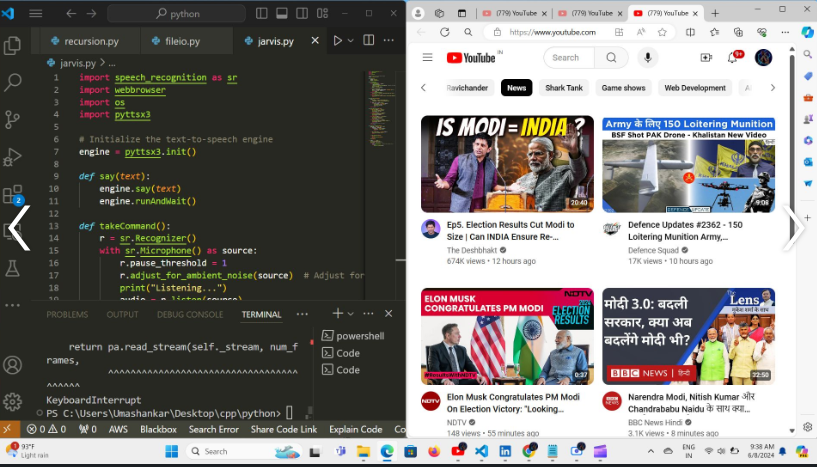

# Pulse

Pulse is an AI platform designed to automate online tasks for visually impaired individuals. The platform leverages advanced AI technologies to assist users in navigating and interacting with digital content, making online activities more accessible and manageable.

## Features

- **Voice Command Integration:** Enables users to control the platform and perform tasks using voice commands.
- **Screen Reader Compatibility:** Works seamlessly with screen readers to provide auditory feedback for on-screen text and elements.
- **Task Automation:** Automates repetitive online tasks such as browsing, form filling, and data retrieval.
- **Personal Assistant:** Acts as a virtual assistant, helping users with daily online activities such as emailing, scheduling, and social media interaction.
- **Accessibility Enhancements:** Provides tools and features to improve the overall accessibility of web content.

## Installation

To install and test the Pulse AI assistant, follow these steps:

1. **Clone the repository:**
    ```sh
    git clone https://github.com/Abhirajtiwari1/pulse.git
    cd pulse
    ```

2. **Create a virtual environment:**
    ```sh
    python -m venv env
    source env/bin/activate   # For Windows: env\Scripts\activate
    ```

3. **Install the dependencies:**
    ```sh
    pip install -r requirements.txt
    ```

## Testing the Voice-Controlled AI Assistant

To test the voice-controlled AI assistant, ensure the following Python libraries are installed:

- `SpeechRecognition`
- `pyttsx3`
- `webbrowser`
- `os`

You can install these libraries using pip:

```sh
pip install SpeechRecognition pyttsx3
```
## Testing And Development Phase
Currently Pulse is at a ideation and development phase. Here are some glimpse of my project: 
 


## Future Aspects Of Pulse:
## 1.Development Of A Interactive Frontend:


